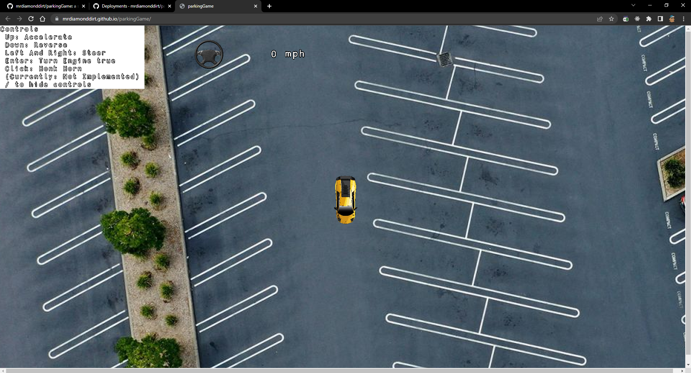

# A (Work in Progress) Parking Game

This is a simple parking game. The goal is to park the car in the parking space. The car can be moved by using the arrow keys. The game is written in JS using the [Kaboom.js](https://kaboomjs.com/) library.

## Try out the game

You can try out the game [here https://mrdiamonddirt.github.io/parkingGame/](https://mrdiamonddirt.github.io/parkingGame/).

## Support

If you like the game, please consider supporting me on
[Github Sponsors](https://github.com/sponsors/mrdiamonddirt)
[Ko-fi](https://ko-fi.com/rowdog) or [PayPal](https://www.paypal.com/paypalme/mrdiamonddirt).
[Patreon](https://www.patreon.com/CopsRP).

## current features

-   [x] Car can be moved by using the arrow keys
-   [x] Car steering is set on the rotation of the steering wheel
-   [x] Car can be moved in all directions
-   [x] Engine sound when starting the car
-   [x] Horn sound when click the mouse
-   [x] Controls List

## planned features

-   [ ] Targets to park the car
-   [ ] Speedometer
-   [ ] mirror the direction of the steering when reversing
-   [ ] Engine sound when moving the car
-   [ ] Car lights

## How to run

1. Clone the repo
2. Run `npm install`
3. Run `npm run dev`
4. Open `localhost:5000` in your browser

## How to play

1. Use the arrow keys to move the car
2. Park the car in the parking space
3. If you hit the wall or another car, you lose
4. If you park the car in the parking space, you win

## how to contribute

1. Fork the repo
2. Create a new branch
3. Make your changes
4. Create a pull request

## License

[MIT](https://choosealicense.com/licenses/mit/)
